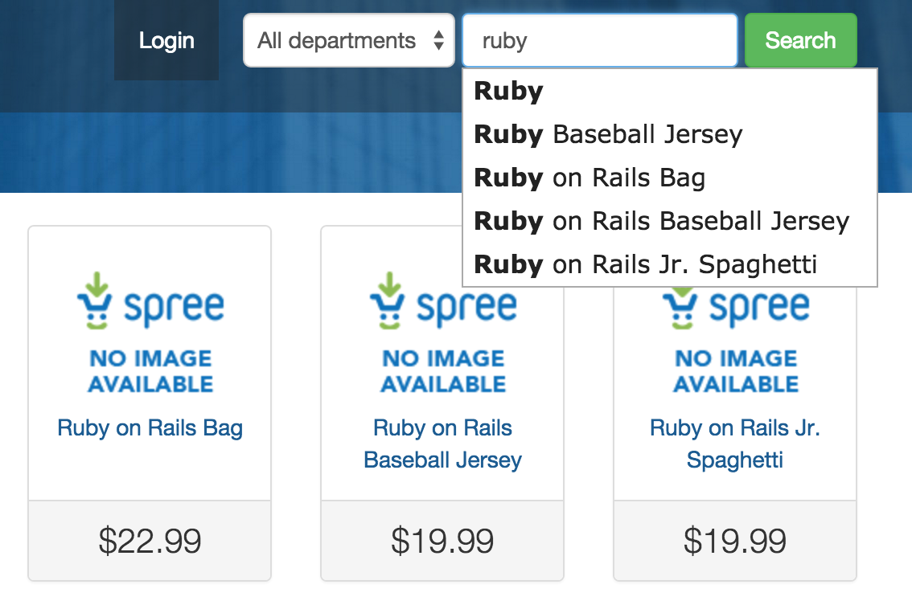

# PLEASE NOTE, THIS PROJECT IS NO LONGER BEING MAINTAINED
# Spree Autosuggest

This extension adds suggestions for product search.

<a href="https://evrone.com/?utm_source=github.com">
  
</a>

## Demo




## Getting Started
### Installation

Add the Spree Autosuggest gem to your `Gemfile`:
  ```ruby
  gem 'spree_autosuggest'
  ```

### Usage

  ```sh
  $ bundle install
  $ rails g spree_autosuggest:install
  ```
  
  
In order to add all Taxon & Product names to the autosuggest database run:
  ```sh
  rake spree_autosuggest:seed
  ```
## Contributing

Please read [Code of Conduct](CODE-OF-CONDUCT.md) and [Contributing Guidelines](CONTRIBUTING.md) for submitting pull requests to us. 

## Authors

* [Aleksey Demidov](https://github.com/ademidov) 
* [Alexander Balashov](https://github.com/divineforest) 

See also the list of [contributors](https://github.com/evrone/spree_autosuggest/graphs/contributors) who participated in this project.

## License

This project is licensed under the [MIT License](LICENSE).
